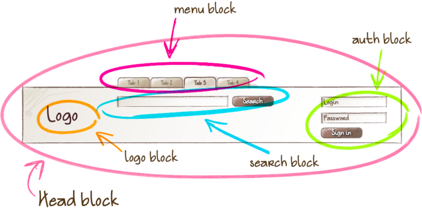

##BEM
> BEM的意思就是块（block）、元素（element）、修饰符（modifier）

####1.Block 
Block 是逻辑和功能上独立的页面组件，独立的Block是可以复用的
```
<!-- 'head' 模块 -->
<header class="header">
    <!-- 嵌套 'logo' 模块 -->
    <div class="logo"></div>

    <!-- 嵌套 'search-form' 模块 -->
    <form class="search-form"></form>
</header>
```
Block 可以被嵌套到任何其他 block 里面去。例如，一个头部 block 可以包含一个 logo、一个搜索表单和一个登录 block。

####2.Element（元素）

```
<!--
     正确的。完整的元素名的结构符合如下模式：
     'block-name__element-name'
 -->
<form class="search-form">
    <div class="search-form__content">
        <input class="search-form__input"/>
        <button class="search-form__button"></button>
    </div>
</form>
```
####3.Modifier（修饰符）
>Modifier 是一个 BEM 实体，它定义了一个 block 或 element 的外观和行为。 
Modifier 可用也可不用（即不一定要用到 modifier）。 
```
<!-- 'search-form' 模块有一个 ‘focused’ 的布尔类型的修饰符 -->
<form class="search-form search-form_focused">
    <input class="search-form__input"/>

    <!-- 'button' 元素有一个 'disabled' 的布尔类型修饰符 -->
    <button class="search-form__button search-form__button_disabled">Search</button>
</form>
```