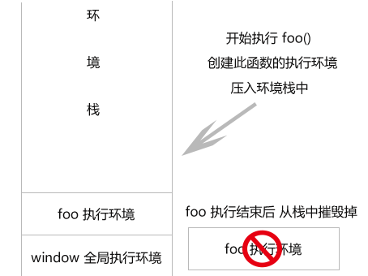
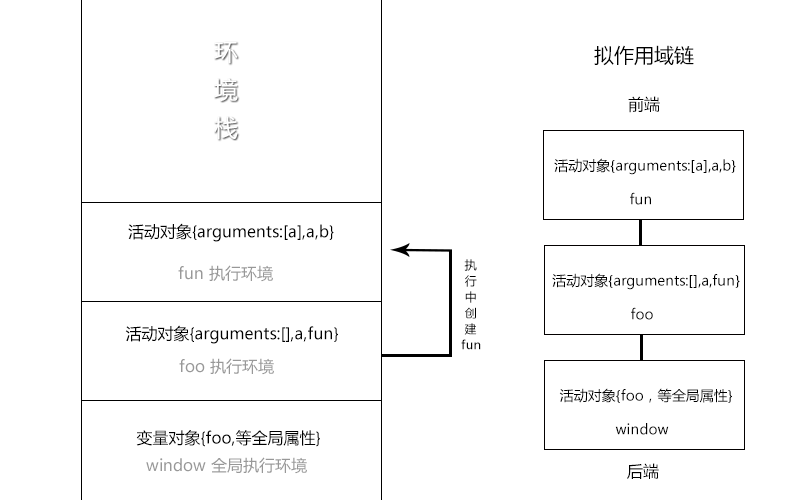
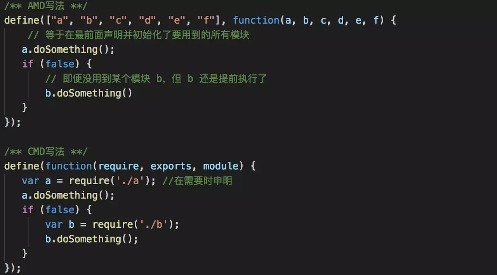

### JS
#### 1. 内置类型
JS有7中内置类型，分为基础类型和对象

基础类型有6种分别是：null，undefined，boolean，string，number，symbol
number是浮点类型的，没有整形。
对象（object）是引用类型，涉及到深拷贝和浅拷贝

#### 2. 类型判断
* typeof 
  基本类型除了null，都能显示正确的类型
  应用类型除了function，都显示object
  `typeof null //'object'`
  `typeof function //'function'`
* instanceof操作符
  A instanceof  B 判断A是否是B的实例
* toString方法
  toString() 是 Object 的原型方法，调用该方法，默认返回当前对象的 [[Class]] 。这是一个内部属性，其格式为 [object Xxx] ，其中 Xxx 就是对象的类型
  Object.prototype.toString.call(xx)
### toString & valueOf

* toString():返回对象的字符表示 （object 的时候返回[object Object] array 的时候 相当于Array.join(',)）
* valueOf():返回对象的字符串，数值，或布尔值值表示

这两个方法一般是交由JS去隐式调用，以满足不同的运算情况。
在数值运算里，会优先调用valueOf()，在字符串运算里，会优先调用toString()。
在有运算操作符的情况下，valueOf的优先级高于toString

一般用操作符单独对对象进行转换的时候，如果对象存在valueOf或toString改写的话，就先调用改写的方法，valueOf更高级，如果没有被改写，则直接调用对象原型的valueOf方法。如果是弹窗的话，直接调用toString方法

### 类型转换
* 转boolean
条件判断时，除了 undefined， null， false， NaN， ''， 0， -0，其他所有值都转为 true，包括所有对象。
* 对象转基本类型
  先会调用 valueOf 然后调用 toString
* 四则运算符
  加法运算时，有一方是字符串，则转化为字符串类型，其他运算，只要一方是数字，那么另外一方就转为数字。
  加法运算会触发：将值转化为原始值，转化为数字，转化为字符串
* == 操作符


###this

###执行上下文
[执行上下文参考](https://github.com/mqyqingfeng/Blog/issues/8)
全局执行上下文
函数执行上下文
eval 执行上下文

每个执行上下文，都包含
1. 变量对象（VO）
2. 作用域链（scope）
3. this

####全局上下文
window
####函数上下文
用活动对象(activation object, AO)来表示变量对象。
活动对象是在进入函数上下文时刻被创建的，它通过函数的 arguments 属性初始化。arguments 属性值是 Arguments 对象。
####执行过程
执行上下文的代码会分成两个阶段进行处理：分析和执行
* 进入执行上下文
变量对象会包括：
  1. 函数的所有形参 (如果是函数上下文)
  2. 函数声明
  3. 变量声明

* 全局上下文的变量对象初始化是全局对象
* 函数上下文的变量对象初始化只包括 Arguments 对象
* 在进入执行上下文时会给变量对象添加形参、函数声明、变量声明等初始的属性值
* 在代码执行阶段，会再次修改变量对象的属性值
* 代码执行

####作用域链

###闭包
在js中，实现外部作用域访问内部作用域中变量的方法叫做闭包（closure）。这得益于高阶函数的特性：函数可以作为参数或者返回值。

通过变相引用函数的活动对象导致其不能被回收，然而形成了依然可以用引用访问其作用域链的结果

1.闭包是指有权访问另一个函数作用域中的变量的函数
2.函数可以通过作用域链相互关联起来，函数内部的变量可以保存在其他函数作用域内，这种特性在计算机科学文献中称为闭包。

####执行环境
环境栈也有人称做它为函数调用栈(都是一回事，只不过后者的命名方式更倾向于函数)，这里我们统称为栈。位于环境栈中最外层是 window ， 它只有在关闭浏览器时才会从栈中销毁。而每个函数都有自己的执行环境.

* 每个函数都有一个与之对应的执行环境。
*  当函数执行时，会把当前函数的环境押入环境栈中，把当前函数执行完毕，则摧毁这个环境。
*  window 全局对象时栈中对外层的(相对于图片来说，就是最下面的)。
* 函数调用栈与环境栈的区别 。 这两者就好像是 JS中原始类型和基础类型 
####变量对象与活动对象
函数中所有的参数，变量，函数

* 每个执行环境有一个与之对应的变量对象。
* 环境中定义的所有变量和函数都保存在这个对象里。
* 对于函数，执行前的初始化阶段叫变量对象，执行中就变成了活动对象。

#### 作用域链
  代码在一个环境中执行时，会创建变量对象的一个作用域链
  [{当前环境的变量对象}，{外层变量对象}，{外层的外层的变量对象}, {window全局变量对象}] 
  

###模块化

####CommonJs规范
  node端使用，提供 module，exports，require，global
  module.exports（不推荐使用exports） 定义输出接口
  require 加载模块（同步）
  exports 是 module.exports 的引用
  不能直接使用exports = （对象，函数）
  CommonJs是同步加载方式，不适用于浏览器端
#### AMD规范
  RequireJS 推广过程对模块定义的规范化产出
  非同步加载模块，允许指定回调
  3个API：
  1. require([module], callback)
  2. define(id, [depends], callback)
  3. require.config()

  提前加载所有的依赖，而不是需要时在加载。

#### CMD规范
CMD 是 SeaJS 在推广过程中对模块定义的规范化产出，CMD是按需加载，就近原则


#### ES6模块化
使用 import 关键字引入模块，通过 exprot 关键字导出模块
，但是由于ES6目前无法在浏览器中执行，所以，我们只能通过babel将不被支持的import编译为当前受到广泛支持的 require

#### CommonJS和ES6的区别
  CommonJs导出的是值得拷贝，ES6输出的是值得引用
  CommonJs是运行时加载，先引用整个模块，使用时在再这个对象上取值。
  Es6是编译时加载，在编译阶段就会完成

  CommonJs是同步导入，import是异步导入
  CommonJs支持动态导入

  后者会编译成require/exports来执行

###call, apply, bind 区别
call 和 apply 都是为了解决改变 this 的指向，作用想同，传参不同
```
getValue.call(a, 'yck', '24')
getValue.apply(a, ['yck', '24'])
```

bind 和其他两个方法作用也是一致的，只是该方法会返回一个函数。并且我们可以通过 bind 实现柯里化。