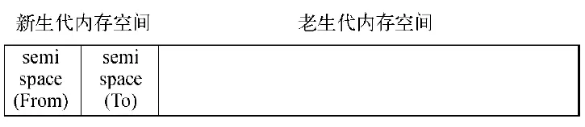
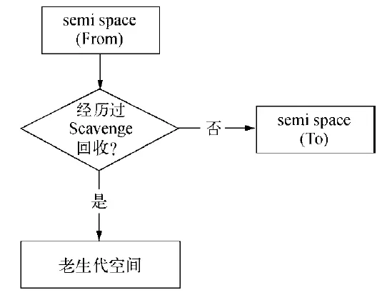
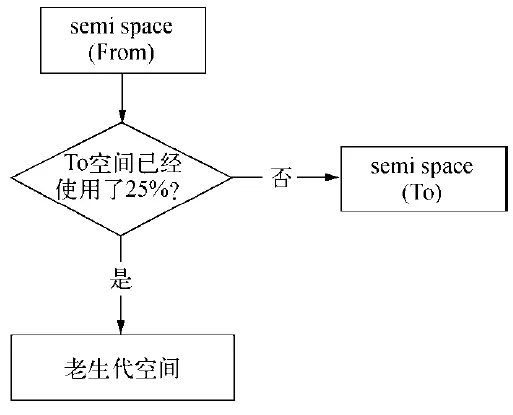

##垃圾回收机制策略
####标记清除算法
JavaScript 中最常用的垃圾收集方式是标记清除（mark-and-sweep）。
两个阶段:
* 标记阶段（mark）
* 清除阶段(sweep)。
1. 标记阶段，垃圾回收器会从根对象开始遍历。每一个可以从根对象访问到的对象都会被添加一个标识，于是这个对象就被标识为可到达对象。
2. 清除阶段，垃圾回收器会对堆内存从头到尾进行线性遍历，如果发现有对象没有被标识为可到达对象，那么就将此对象占用的内存回收，并且将原来标记为可到达对象的标识清除，以便进行下一次垃圾回收操作

标记清除算法缺陷:
* 那些无法从根对象查询到的对象都将被清除
* 垃圾收集后有可能会造成大量的**内存碎片**

####引用计数算法
这是最初级的垃圾收集算法.现在已经没有浏览器会用这种算法.
引用计数的含义是跟踪记录每个值被引用的次数。

引用计数缺陷
* 无法处理循环引用。
####Chrome V8 垃圾回收算法
分代回收策略
通过区分「临时」与「持久」对象；多回收「临时对象区」（新生代younggeneration），少回收「持久对象区」（老生代 tenured generation），减少每次需遍历的对象，从而减少每次GC的耗时。

#####V8的分代回收（Generation GC）

1. **V8的内存分代:**
在V8中，主要将内存分为新生代和老生代，新生代内存 存储的为存活时间较短的对象，老生代内存 存储的为存活时间较长或常驻内存的对象.

Cheney算法是一种采用复制的方式实现的垃圾回收算法。
它将堆内存一分为二，每一部分空间称为semispace。在这两个semispace空间中，只有一个处于使用中(**From空间**)，另一个处于闲置状态(**To空间**)。

当我们分配对象时，先是在From空间中进行分配。当开始进行垃圾回收时，会检查From空间中的存活对象，这些存活对象将被复制到To空间中，而(From空间内的)非存活对象占用的空间将会被释放。完成复制后，From空间和To空间的角色发生对换(即以前的From空间释放后变为To;To空间在复制存活的对象后,变为From空间)。简而言之，在垃圾回收过程中，就是通过将存活对象在两个semispace空间之间进行复制。

缺点：使用一半的内存，空间换取时间的算法

**晋升:** 一个对象经过多次复制依然存活时，它将会被认为是生命周期较长的对象。这种较长生命周期的对象随后会被移动到老生代中，采用新的算法进行管理。对象从新生代中移动到老生代中的过程称为晋升。

2. **V8老生代算法（Mark-Sweep && Mark-Compact）:**
>对于老生代中的对象，由于存活对象占较大比重，再采用Scavenge的方式会有两个问题：一个是存活对象较多，复制存活对象的效率将会很低；另一个问题依然是浪费一半空间的问题。为此，V8在老生代中主要采用Mark-Sweep和Mark-Compact相结合的方式进行垃圾回收。

(1) Mark-Sweep:
Mark-Sweep在标记阶段遍历堆中所有对象，并标记活着的对象，在随后的清除阶段中，只清除没有被标记的对象。
**Scavenge中只复制活着的对象，而Mark-Sweep只清理死亡对象。**
V8主要使用Mark-Sweep，在空间不足以对从新生代中晋升过来的对象进行分配时才使用Mark-Compact。

3. **增量式标记回收(Incremental Marking):**
* 为了避免出现js应用逻辑与垃圾回收器看到的不一致的情况，垃圾回收的3种基本算法都需要将应用逻辑暂停下来，待执行完垃圾回收后再恢复执行应用逻辑，这种行为被称为“全停顿”（stop-the-world）。
* 为了降低全堆垃圾回收带来的停顿时间，V8先从标记阶段入手，将原本要一口气停顿完成的动作改为增量标记（incremental marking），也就是拆分为许多小“步进”，每做完一“步进”就让js应用逻辑执行一小会，垃圾回收与应用逻辑交替执行直到标记阶段完成。

**V8主要使用Mark-Sweep，在空间不足以对从新生代中晋升过来的对象进行分配时才使用Mark-Compact。**
#### 内存泄漏
* 缓存；
**慎将内存当作缓存**
进程之间可以共享缓存。
目前，市面上比较好的缓存有Redis和Memcached。
将缓存转移到外部，减少常驻内存的对象的数量，让垃圾回收更高效；
* 队列消费不及时；
生产速度因为某些原因突然激增，或者消费速度因为突然的系统故障降低，内存泄漏还是可能出现的。
* 作用域未释放。

[nodejs-memory](https://github.com/zqjflash/nodejs-memory)