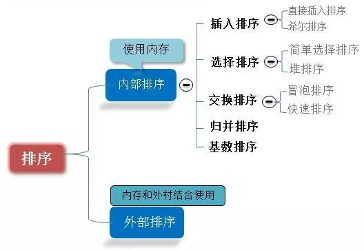
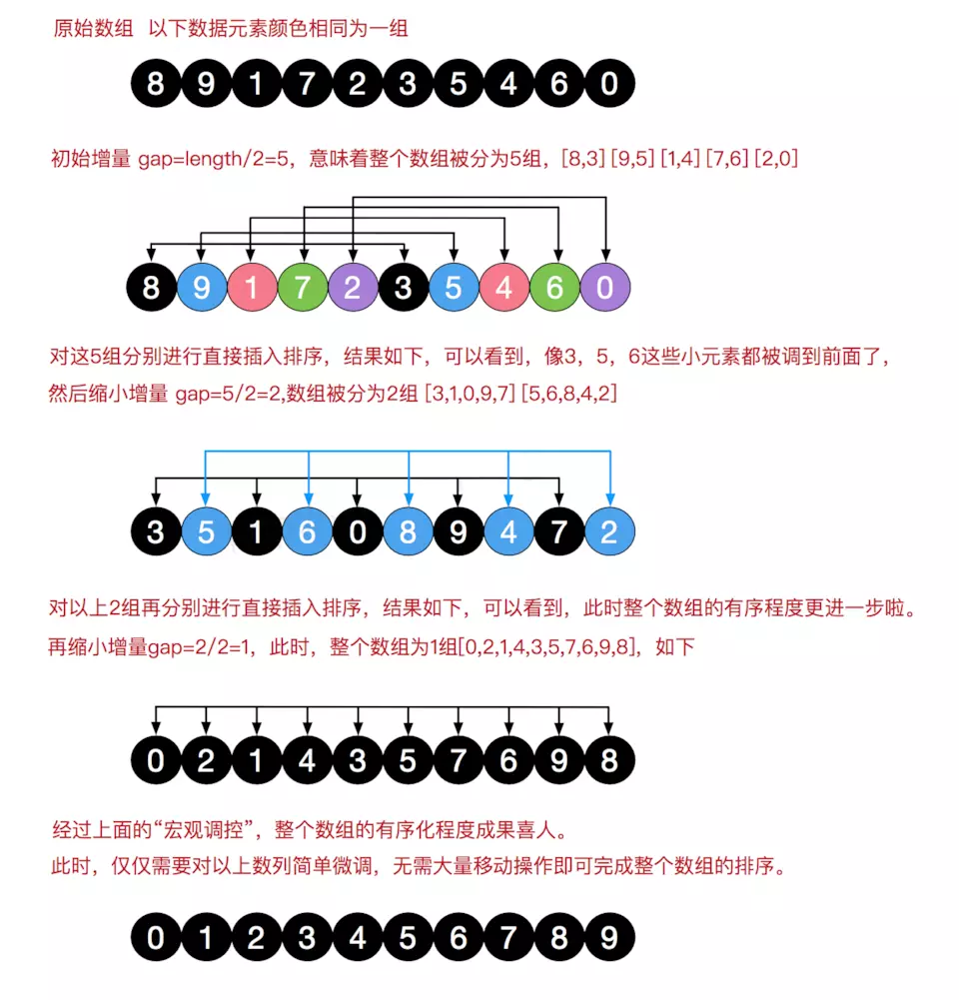

### 排序分类

1. 插入排序：
* 直接插入排序
* 希尔排序
2. 选择排序
* 简单选择排序
* 堆排序
3. 交换排序
* 冒泡排序
* 快速排序

#### 1. 冒泡排序
大致思路是两层循环嵌套,一次比较两个元素，如果它们的顺序错误就把它们交换过来

```
function bubbleSort(arr) {
    var len = arr.length;
    for (var i = 0; i < len; i++) {
        for (var j = 0; j < len - 1 - i; j++) {
            if (arr[j] > arr[j+1]) {        //相邻元素两两对比
			[arr[j],arr[j+1]] = [arr[j+1],arr[j]]  //通过解构完成元素交换
                
            }
        }
    }
    return arr;
}
```
#### 2.快速排序（Quick Sort）
**处理大数据最快的排序算法之一**

思路: 快速排序属于高级排序算法,此时就不是相似的循环嵌套.它的大概思想就是: 找到一个数作为参考，比这个数字大的放在数字左边，比它小的放在右边； 然后分别再对左边和右变的序列做相同的操作(递归).
```
function partition2(arr, low, high) {
  let pivot = arr[low];
  while (low < high) {
    while (low < high && arr[high] > pivot) {
      --high;
    }
    arr[low] = arr[high];
    while (low < high && arr[low] <= pivot) {
      ++low;
    }
    arr[high] = arr[low];
  }
  arr[low] = pivot;
  return low;
}

function quickSort2(arr, low, high) {
  if (low < high) {
    let pivot = partition2(arr, low, high);
    quickSort2(arr, low, pivot - 1);
    quickSort2(arr, pivot + 1, high);
  }
  return arr;
}。
```
#### 3.选择排序
大致思路也是两层循环嵌套

时间复杂度:O(n²)
```
function selectionSort(arr) {
    var len = arr.length;
    var minIndex, temp;
    for (var i = 0; i < len - 1; i++) {
        minIndex = i;   //用来保存最小数
        for (var j = i + 1; j < len; j++) {
            if (arr[j] < arr[minIndex]) {     //寻找最小的数
                minIndex = j;                 //将最小数的索引保存
            }
        }
		[arr[minIndex],arr[i]] = [arr[i],arr[minIndex]]  //通过解构完成元素交换
    }
    return arr;
}
```

#### 4. 插入排序（Insertion Sort）
插入排序（Insertion-Sort）的算法描述是一种简单直观的排序算法。它的工作原理是通过构建有序序列，对于未排序数据，在已排序序列中从后向前扫描，找到相应位置并插入。
思路:大致思路也是两层循环嵌套

```
function insertSort(arr) {
    for(let i = 1; i < arr.length; i++) {  //外循环从1开始，默认arr[0]是有序段
        for(let j = i; j > 0; j--) {  //j = i,表示此时你起在手上的那张牌,将arr[j]依次比较插入有序段中
            if(arr[j] < arr[j-1]) {
                [arr[j],arr[j-1]] = [arr[j-1],arr[j]];  //其实这里内循环中,只要比它前一个数小就交换,直到没有更小的,就break退出.这和动图表示的插入还是有点区别的,但最后结果其实是一样的.
            } else {
                break;
            }
        }
    }
    return arr;
}
```

#### 5.希尔排序
是简单插入排序的改进版；它与插入排序的不同之处在于，它会优先比较距离较远的元素

```
function shellSort(arr) {
    var len = arr.length,
        temp,
        gap = 1;
    while(gap < len/5) {          //动态定义间隔序列
        gap =gap*5+1;
    }
    for (gap; gap > 0; gap = Math.floor(gap/5)) {
        for (var i = gap; i < len; i++) {
            temp = arr[i];
            for (var j = i-gap; j >= 0 && arr[j] > temp; j-=gap) {
                arr[j+gap] = arr[j];
            }
            arr[j+gap] = temp;
        }
    }
    return arr;
}
```