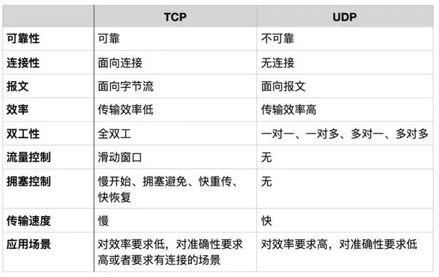
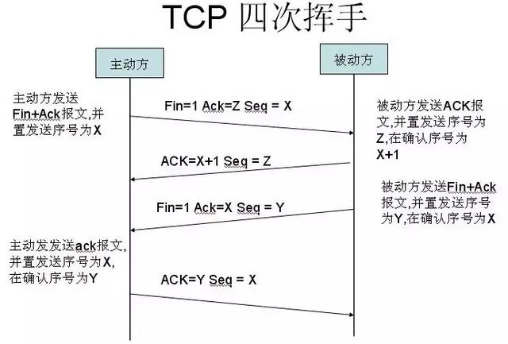

###TCP/IP协议模型
#####网络体系结构
* 分层：我们根据不同的功能把网络模型分层。
* 协议：不同层之间规定了不同协议，每个层遵循每个层的网络协议完成完成功能。
* 接口：层与层之间会通过接口去进行交互。

每发送一个http请求，是针对应用层的请求和响应。应用层虽然来回只有一次。但它下面传输层，要把整个报文，分成许多分组，再交给下一层，基于TCP/IP的参考模型将协议分成四个层次。

[协议参考](https://hit-alibaba.github.io/interview/basic/network/HTTP.html)
#### 1 应用层
* 浏览器根据http协议，产生报文头和主体
* 对并报文进行编码，加密，压缩。
* 将数据封装好后，交给下一层，我们将这一层的PUD叫 **报文（message）**
HTTP(超文本传输协议)，FTP（文件传输协议）、
#### 2 传输层
TCP、UDP协议

#### 3 网络层
IP协议
#### 4 数据链路层
以二进制数据形式在物理媒体上传输数据

#### 2 TCP连接的建立与终止
1.三次握手
TCP是面向连接的，无论哪一方向另一方发送数据之前，都必须先在双方之间建立一条连接.在TCP/IP协议中，TCP协议提供可靠的连接服务，连接是通过三次握手进行初始化的。

所谓三次握手(Three-way Handshake)，是指建立一个 TCP 连接时，需要客户端和服务器总共发送3个包。

2.四次挥手

#### HTTP 超文本协议 是一个基于请求与响应模式的，无状态，应用层协议
HTTP请求
状态行：请求方式（Method），资源路径，协议版本
请求头：访问域名，用户代理，Cookie信息
请求正文：HTTP请求的数据
HTTP响应
状态行：包括协议版本Version、状态码Status Code、回应短语；
响应头：包括搭建服务器的软件，发送响应的时间，回应数据的格式等信息；
响应正文：就是响应的具体数据

#####HTTP之状态码
状态代码有三位数字组成，第一个数字定义了响应的类别，共分五种类别:

1xx：指示信息--表示请求已接收，继续处理
2xx：成功--表示请求已被成功接收、理解、接受
3xx：重定向--要完成请求必须进行更进一步的操作
4xx：客户端错误--请求有语法错误或请求无法实现
5xx：服务器端错误--服务器未能实现合法 的请求

200---OK/请求已经正常处理完毕
301---/请求永久重定向
302---/请求临时重定向
304---/请求被重定向到客户端本地缓存
400---/客户端请求存在语法错误
401---/客户端请求没有经过授权
403---/客户端的请求被服务器拒绝，一般为客户端没有访问权限
404---/客户端请求的URL在服务端不存在
500---/服务端永久错误
503---/服务端发生临时错误

####HTTP请求方法
GET     请求获取Request-URI所标识的资源
POST    在Request-URI所标识的资源后附加新的数据 // 常用于提交表单。
> * HTTP 协议 未规定 GET 和POST的长度限制
> * GET的最大长度显示是因为 浏览器和 web服务器限制了 URI的长度
>  * 不同的浏览器和WEB服务器，限制的最大长度不一样
>  * 要支持IE，则最大长度为2083byte，若只支持Chrome，则最大长度 8182byte
>  * get请求类似于查找的过程，用户获取数据，可以不用每次都与数据库连接，所以可以使用缓存。
>  * post不同，post做的一般是修改和删除的工作，所以必须与数据库交互，所以不能使用缓存。因此get请求适合于请求缓存。

HEAD    类似于get请求，只不过返回的响应中没有具体的内容，用于获取报头
PUT     请求服务器存储一个资源，并用Request-URI作为其标识
DELETE  请求服务器删除Request-URI所标识的资源
TRACE   请求服务器回送收到的请求信息，主要用于测试或诊断
CONNECT 保留将来使用
OPTIONS 请求查询服务器的性能，或者查询与资源相关的选项和需求

####HTTP 工作原理

在浏览器地址栏键入URL，按下回车之后会经历以下流程：
1、浏览器向 DNS 服务器请求解析该 URL 中的域名所对应的 IP 地址;
2、解析出 IP 地址后，根据该 IP 地址和默认端口 80，和服务器建立TCP连接;
3、浏览器发出读取文件(URL 中域名后面部分对应的文件)的HTTP 请求，该请求报文作为 TCP 三次握手的第三个报文的数据发送给服务器;
4、服务器对浏览器请求作出响应，并把对应的 html 文本发送给浏览器;
5、释放 TCP连接;
6、浏览器将该 html 文本并显示内容;

HTTPS 以安全为目标的HTTP通道，HTTP的安全版
HTTPS：应用层->安全层（SSL/TSL）->传输层->网络层->链路层
* Https协议需要ca证书，费用较高。
* http是超文本传输协议，信息是明文传输，https则是具有安全性的ssl加密传输协议。
* 使用不同的链接方式，端口也不同，一般而言，http协议的端口为80，https的端口为443
* http的连接很简单，是无状态的；HTTPS协议是由SSL+HTTP协议构建的可进行加密传输、身份认证的网络协议，比http协议安全。

> 客户使用https url访问服务器，则要求web 服务器建立ssl链接。
web服务器接收到客户端的请求之后，会将网站的证书（证书中包含了公钥），返回或者说传输给客户端。
客户端和web服务器端开始协商SSL链接的安全等级，也就是加密等级。
客户端浏览器通过双方协商一致的安全等级，建立会话密钥，然后通过网站的公钥来加密会话密钥，并传送给网站。
web服务器通过自己的私钥解密出会话密钥。
web服务器通过会话密钥加密与客户端之间的通信。
