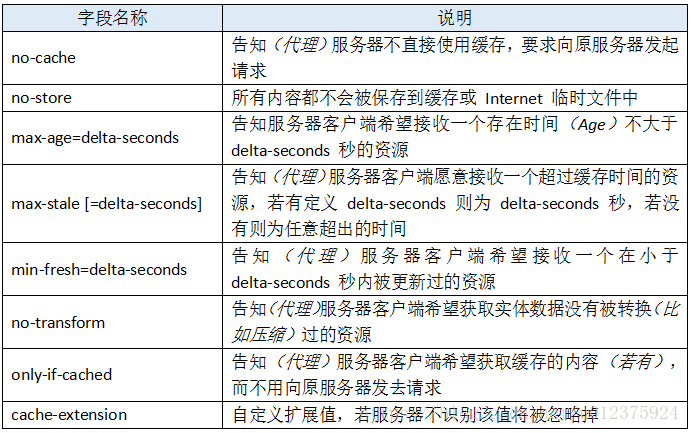
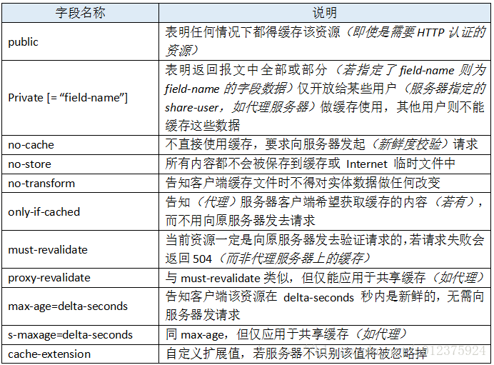
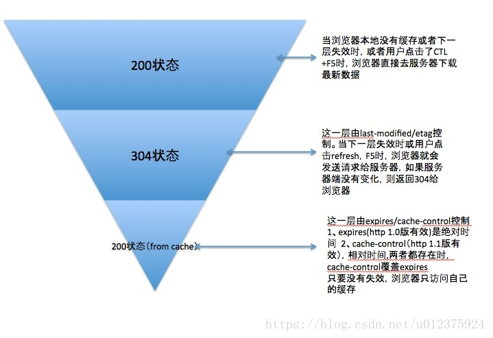

##缓存
-----
良好的缓存策略可以降低资源的重复加载提高网页的整体加载速度
请求更快
节省宽带
降低服务器压力（并发）

缓存分为服务端缓存（CDN） 和 客服端缓存（浏览器）

###浏览器缓存机制详解
* 强缓存
* 协商缓存

##### 1.强缓存
加载资源是根据http header 判断是否命中强缓存，命中直接从缓存中读取资源，不会发送到浏览器。
强缓存期间不需要再次请求 from-cache
1. Pragma
2. Expires
   code 是 200，指定时间过期，受本地时间影响
   `Expires: Wed, 22 Oct 2018 08:41:00 GMT`
3. Cache-control
   优先级大于Expires 30秒后过期，需要再次请求
   `Cache-control: max-age=30`
   值：
   
   在响应中使用Cache-Control 时，它可选的值有：
   

   Pragma > Cache-control > Expires

#### 2.协商缓存
没有命中强缓存。浏览器发送一个请求到服务器，通过http header 验证是否命中协商缓存，如果命中，则返回（304），但是不会返回资源的数据。未命中则返回资源数据code为200

Last-Modified/If-Modified-Since：Last-Modified/If-Modified-Since要配合Cache-Control使用。

1. Last-Modified 和 If-Modified-Since
Last-Modified 表示本地文件最后修改日期，If-Modified-Since将Last-Modified发送给服务端，如果服务端在这个时间后有更新，则返回新的文件。（Last-Modified 本地打开后，时间会修改，所以可以Etag）
2. ETag 和 If-None-Match
Etag相当于文件指纹，If-None-Match将Etag发送给服务器，如果服务器该文件的Etag改变后，就将新的文件返回回来。Etag的优先级高于Last-Modified

#### 3.合适的缓存策略
1. Expires / Cache-Control
   为了兼容均设置Expires 、Cache-Control 在1.0使用Expires，1.1Cache-Control会覆盖Expires
2. 不需要缓存的资源使用，cache-control：no-store；or Pragma：no-store
2. 需要多次修改的情况，或者其他Last-Modified处理不了的情况，才使用ETag（Last-Modified标注的最后修改只能精确到秒级），否则使用Last-Modified。
3. 对于所有可缓存资源，需要指定一个Expires或Cache-Control，同时指定Last-Modified或者Etag。
4. 可以通过标识文件版本名、加长缓存时间的方式来减少304响应。
5. 对于某些不需要缓存的资源，可以使用 Cache-control: no-store ，表示该资源不需要缓存
6. 对于频繁变动的资源，可以使用 Cache-Control: no-cache 并配合 ETag 使用，表示该资源已被缓存，但是每次都会发送请求询问资源是否更新。

####总结

强缓存和协商缓存的区别是强缓存不需要发起一个请求，协商缓存需要发送请求。
如何设置缓存
1. HTTP头信息控制缓存
HTTP头信息控制缓存是通过Expires（强缓存）、Cache-control（强缓存）、Last-Modified/If-Modified-Since（协商缓存）、Etag/If-None-Match（协商缓存）实现

