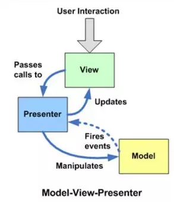

####前端软件架构模式
MVC，MVP和MVVM都是常见的软件架构设计模式（Architectural Pattern），它通过分离关注点来改进代码的组织方式。
####MVC模式
* MVC模式（Model–view–controller）:是软件工程中的一种软件架构模式，把软件系统分为三个基本部分：模型（Model）、视图（View）和控制器（Controller）。
* 模型（Model） - Model层用于封装和应用程序的业务逻辑相关的数据以及对数据的处理方法。一旦数据发生变化，模型将通知有关的视图。
视图（View） - View作为视图层，主要负责数据的展示,并且响应用户操作.
* 控制器（Controller）- 控制器是模型和视图之间的纽带，接收View传来的用户事件并且传递给Model，同时利用从Model传来的最新模型控制更新View.

**方式:所有方式都是单向通信**
#### MVP模式
**各部分之间都是双向通信**

#### MVVM
View：界面
Model：数据模型
ViewModel：View和Model之间的桥梁

**双向绑定。View/Model的变动，自动反映在 ViewModel，反之亦然。**
#####实现数据绑定的方式：
* 数据劫持 (Vue)
* 发布-订阅模式 (Knockout、Backbone)
* 脏值检查 (旧版Angular)

UI是通过数据驱动的，数据变化了会更新对应的UI，UI改变也会更新对应的Model

数据双向绑定 Angluar 脏数据检测 Vue数据劫持

######脏数据检测
数据双向绑定
界面到数据的更改，是通过UI事件，Ajax请求，或者timeout等回调，数据到界面的更改是通过脏数据检测

只有触发UI事件，Ajax请求，或者timeout的延迟，才会触发脏检查
点击一次button,counter就会+1,因为点击事件,将couter+1,而后触发了脏检查,又将新值2 返回给了界面

当触发指定事件后，会执行$digest函数循环遍历所有的观察者，判断值是有变化，有变化的话会调用处理函数（用新值代替老值），然后继续调用观察者，直到么有变化

每个绑定到UI上的数据，都有一个watch对象

###Vue数据劫持
Object.defineProperty() 

新版本Proxy 替换 Object.defineProperty() 

